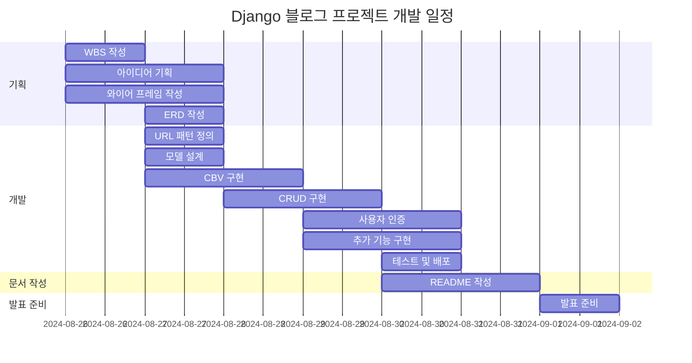
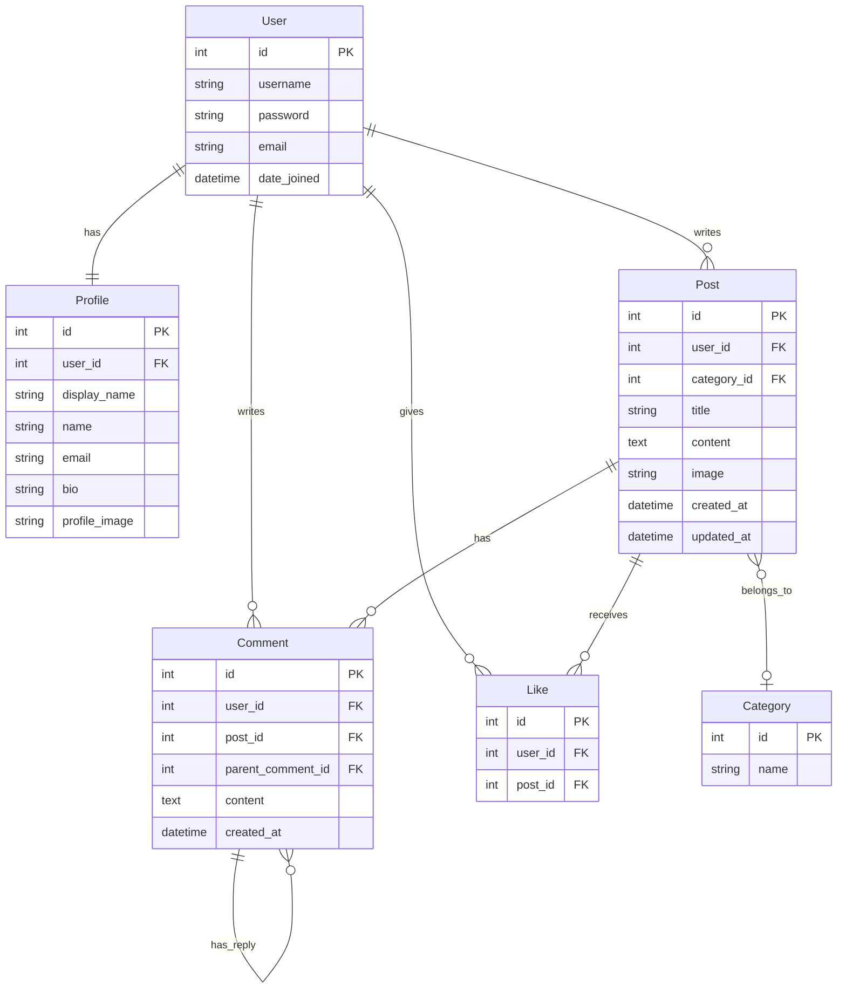

# WBS

```mermaid
gantt
    title Django 블로그 프로젝트 개발 일정
    dateFormat  YYYY-MM-DD

    section 기획
    WBS 작성 :2024-08-26, 1d
    아이디어 기획 :2024-08-26, 2d
    와이어 프레임 작성 :2024-08-26, 2d
    ERD 작성 :2024-08-27, 1d

    section 개발
    URL 패턴 정의 :2024-08-27, 1d
    모델 설계 :2024-08-27, 1d
    CBV 구현 :2024-08-27, 2d
    CRUD 구현 :2024-08-28, 2d
    사용자 인증 :2024-08-29, 2d
    추가 기능 구현 :2024-08-29, 2d
    테스트 및 배포:2024-08-30, 1d

    section 문서 작성
    README 작성 :2024-08-30, 2d

    section 발표 준비
    발표 준비 :2024-09-01, 1d
```

# WireFrame

[link](https://www.figma.com/design/teJ06xvveV1K8VuVuRbss0/Untitled?node-id=0-1&t=5dxv9WNU6DnQAgnH-0)

# ERD

```mermaid

erDiagram
    User ||--|| Profile : has
    User ||--o{ Post : writes
    User ||--o{ Comment : writes
    User ||--o{ Like : gives
    Post ||--o{ Comment : has
    Post ||--o{ Like : receives
    Post }o--o| Category : belongs_to
    Comment ||--o{ Comment : has_reply

    User {
        int id PK
        string username
        string password
        string email
        datetime date_joined
    }

    Profile {
        int id PK
        int user_id FK
        string display_name
        string name
        string email
        string bio
        string profile_image
    }

    Post {
        int id PK
        int user_id FK
        int category_id FK
        string title
        text content
        string image
        datetime created_at
        datetime updated_at
    }

    Category {
        int id PK
        string name
    }

    Comment {
        int id PK
        int user_id FK
        int post_id FK
        int parent_comment_id FK
        text content
        datetime created_at
    }

    Like {
        int id PK
        int user_id FK
        int post_id FK
    } 

```
