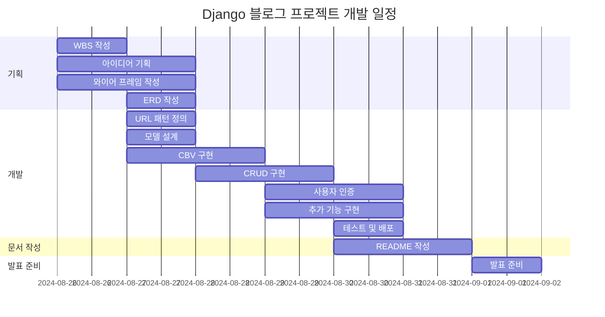
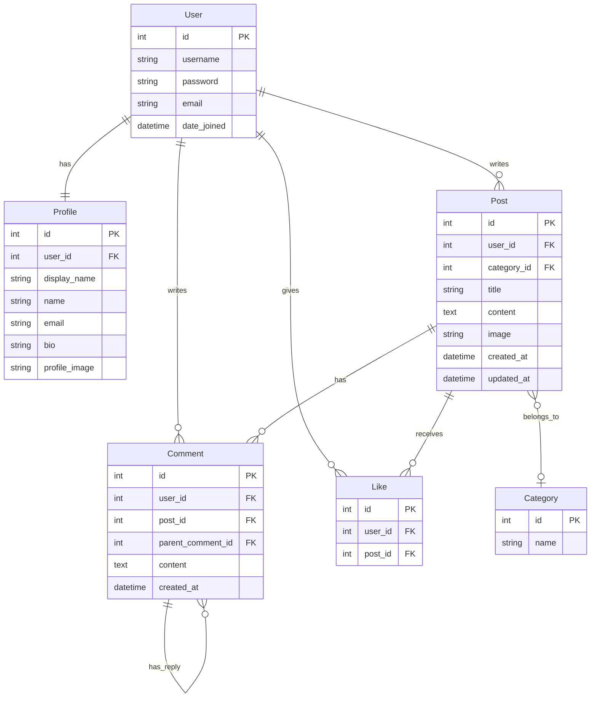

# 목표

# WBS

# ERD

# 명세
| App      | URL Pattern                    | View                       | Description                     |
| -------- | ------------------------------ | -------------------------- | ------------------------------- |
| config   | /admin/                         | admin.site            | Django admin        |
| config   | /                        | MainPageView            | 메인페이지        |
| config   | blog/                        | blog url            | 블로그 url        |
| config   | accounts/                        | accounts url            | 계정 관련 url        |
| blog     | blog/                             | PostListView               | 블로그 게시물 목록              |
| blog     | blog/search/<str:tag>                        | PostSearchView                 | 제목, 내용, 글쓴이 중에 선택하여 검색               |
| blog     | blog/<int:id>                      | PostDetailView             | 블로그 게시물 상세              |
| blog     | blog/write                        | PostCreateView             | 블로그 게시물 생성              |
| blog     | blog/edit/<int:id>               | PostUpdateView             | 블로그 게시물 수정          |
| blog     | blog/delete/<int:id>               | PostDeleteView             | 블로그 게시물 삭제              |
| accounts | accounts/login                      | CustomLoginView               | 사용자 로그인                     |
| accounts | accounts/logout                      | LogoutView               | 사용자 로그아웃                     |
| accounts | accounts/register/                      | SignUpView               | 사용자 등록                     |
| accounts | accounts/edit                      | UserProfileUpdateView               | 사용자 정보 수정                     |
| accounts | accounts/password_change                        | CustomPasswordChangeView            | 비밀번호 변경                   |

# 와이어 프레임

[Figma URL](https://www.figma.com/design/teJ06xvveV1K8VuVuRbss0/Untitled?node-id=0-1&t=5dxv9WNU6DnQAgnH-0)

# 화면 설계

